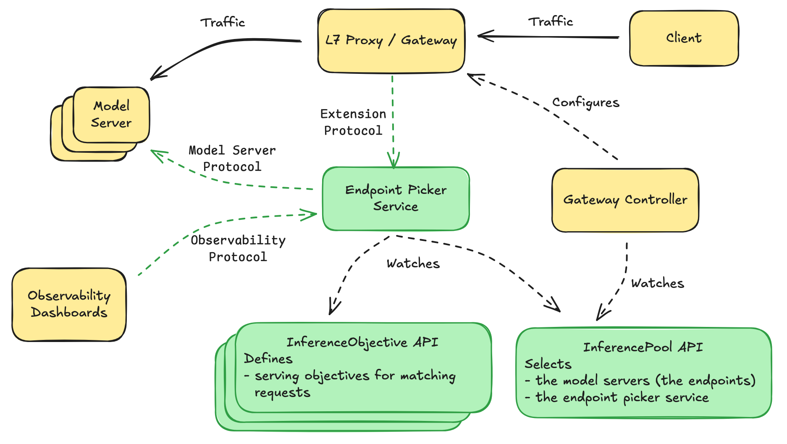

## NGINX Gateway Fabric — LLM Inference Routing

This repo show example of NGINX Gateway Fabric (NGF) with the Gateway API Inference Extension to route LLM inference traffic based on:
- Model selection (cheap vs expensive models)
- Inference objectives / priorities
- Endpoint Picker (EPP) choosing backend


Diagram from EPP Github page

The demo uses lightweight LLM simulator backends and works on any local Kubernetes cluster.

### 1. Install NGF with Inference Extension enabled
 
   Check documentaion at https://docs.nginx.com/nginx-gateway-fabric/

### 2. Deploy the two model servers
```
$ kubectl apply -f models.yaml

$ kubectl get pods | grep llm-sim
cheap-llm-sim-abc123       Running
cheap-llm-sim-def456       Running
expensive-llm-sim-aaa111   Running
expensive-llm-sim-bbb222   Running
```

### 3. Create the two InferencePools (cheap + expensive)

```
$ export IGW_CHART_VERSION=v1.0.1
```

Cheap pool:
```
$ helm install cheap-llm-pool \
  --set inferencePool.modelServers.matchLabels.app=cheap-llm-sim \
  --version $IGW_CHART_VERSION \
  oci://registry.k8s.io/gateway-api-inference-extension/charts/inferencepool
```

Expensive pool:
```
$ helm install expensive-llm-pool \
  --set inferencePool.modelServers.matchLabels.app=expensive-llm-sim \
  --version $IGW_CHART_VERSION \
  oci://registry.k8s.io/gateway-api-inference-extension/charts/inferencepool
```
Check them:
```
$ kubectl get inferencepools.inference.networking.k8s.io
NAME                 AGE
cheap-llm-pool       7d17h
expensive-llm-pool   7d17h

$ kubectl get deploy,svc | grep -E 'cheap-llm-pool|expensive-llm-pool'
deployment.apps/cheap-llm-pool-epp        1/1     1            1           7d17h
deployment.apps/expensive-llm-pool-epp    1/1     1            1           7d17h
service/cheap-llm-pool-epp            ClusterIP   10.97.141.165   <none>        9002/TCP,9090/TCP   7d17h
service/cheap-llm-pool-pool-svc       ClusterIP   None            <none>        8000/TCP            7d17h
service/expensive-llm-pool-epp        ClusterIP   10.106.37.207   <none>        9002/TCP,9090/TCP   7d17h
service/expensive-llm-pool-pool-svc   ClusterIP   None            <none>        8000/TCP            7d17h
```

### 4. Apply InferenceObjective (priority classes)
```
$ kubectl apply -f objectives.yaml

$ kubectl get inferenceobjectives.inference.networking.x-k8s.io 
NAME        INFERENCE POOL       PRIORITY   AGE
batch-low   expensive-llm-pool   1          22h
chat-high   expensive-llm-pool   100        22h
```


### 5. Create NGF Gateway + HTTPRoute
```
$ kubectl apply -f ngf-gw.yaml
$ kubectl apply -f http-route.yaml

$ kubectl get gateway inference-gateway
NAME                CLASS   ADDRESS        PROGRAMMED   AGE
inference-gateway   nginx   10.97.215.83   True         7d17h

$ kubectl describe httproute llm-demo-route
```

### 6. Expose NGF
```
kubectl port-forward svc/inference-gateway-nginx -n nginx-gateway 8080:80
```

### 7. Test

Terminal 1 — flood the pool with low-priority traffic
```
for i in {1..100}; do
  curl -s -o /dev/null -w "batch $i latency: %{time_total}s\n" \
    http://127.0.0.1:8080/v1/completions \
    -H "Content-Type: application/json" \
    -H "X-Gateway-Model-Name: my-org/chat-quality" \
    -H "x-gateway-inference-objective: batch-low" \
    -d "{\"model\": \"my-org/chat-quality\", \"prompt\": \"Batch $i\", \"max_tokens\": 512}" &
done
```

Terminal 2 — send high-priority chat traffic
```
for i in {1..10}; do
  curl -s -o /dev/null -w "chat $i latency: %{time_total}s\n" \
    http://127.0.0.1:8080/v1/completions \
    -H "Content-Type: application/json" \
    -H "X-Gateway-Model-Name: my-org/chat-quality" \
    -H "x-gateway-inference-objective: chat-high" \
    -d "{\"model\": \"my-org/chat-quality\", \"prompt\": \"Chat $i\", \"max_tokens\": 64}"
done
```

Note: The simulators respond very quickly, so the effect will be subtle on this envirnment.
The test still demonstrates correct wiring of priority metadata.

In real-world environemtn with real models running on GPUs, you should see:
- chat-high latency remains stable
- batch-low latency varies more under load

### 8. Metrics & Observability

Create EPP metrics RBAC (ClusterRole, SA, Binding, Secret)
```
kubectl apply -f epp-metrics-rbac.yaml
```

Port-forward the EPP
```
kubectl -n default port-forward deploy/expensive-llm-pool-epp 9090:9090
```

Get the ServiceAccount token
```
TOKEN=$(kubectl -n default get secret inference-gateway-sa-metrics-reader-secret \
        -o jsonpath='{.data.token}' | base64 --decode)
```

Curl the metrics endpoint
```
curl -H "Authorization: Bearer $TOKEN" http://127.0.0.1:9090/metrics | head -n 40
```

Example output
```
...
inference_model_request_sizes_sum{model_name="my-org/chat-quality",target_model_name="my-org/chat-quality"} 74081
inference_model_request_sizes_count{model_name="my-org/chat-quality",target_model_name="my-org/chat-quality"} 783
inference_model_request_total{model_name="my-org/chat-quality",target_model_name="my-org/chat-quality"} 783
inference_model_running_requests{model_name="my-org/chat-quality"} 0
inference_pool_average_kv_cache_utilization{name="expensive-llm-pool"} 0
inference_pool_average_queue_size{name="expensive-llm-pool"} 0
inference_pool_per_pod_queue_size{model_server_pod="expensive-llm-sim-b9c8f95b5-npffl",name="expensive-llm-pool"} 0
inference_pool_per_pod_queue_size{model_server_pod="expensive-llm-sim-b9c8f95b5-tgl48",name="expensive-llm-pool"} 0
inference_pool_ready_pods{name="expensive-llm-pool"} 2
process_cpu_seconds_total 21459.2
process_max_fds 1.048576e+06
process_network_receive_bytes_total 3.4720290962e+10
process_network_transmit_bytes_total 3.074174655e+09
process_open_fds 15
process_resident_memory_bytes 1.1067392e+08
...
```

### 8. Prometheus (Optional)
Create the monitoring namespace:
```
kubectl create namespace monitoring
```

Create ServiceAccount + RBAC for Prometheus to read EPP metrics:
```
kubectl apply -f https://github.com/kubernetes-sigs/gateway-api-inference-extension/raw/main/config/observability/prometheus/rbac.yaml
```

Patch the ClusterRoleBinding to use the monitoring namespace:
```
kubectl patch clusterrolebinding inference-gateway-sa-metrics-reader-role-binding \
  --type='json' \
  -p='[{"op": "replace", "path": "/subjects/0/namespace", "value": "monitoring"}]'
```
Install Prometheus with values that scrape EPP metrics on port 9090 using the RBAC created above:
```
helm repo add prometheus-community https://prometheus-community.github.io/helm-charts

helm install prometheus prometheus-community/prometheus \
  --namespace monitoring \
  -f https://github.com/kubernetes-sigs/gateway-api-inference-extension/raw/main/config/observability/prometheus/values.yaml
```
Check Prometheus targets:
```
kubectl -n monitoring port-forward deploy/prometheus-server 9091:9090
```
Open: http://127.0.0.1:9091/targets


